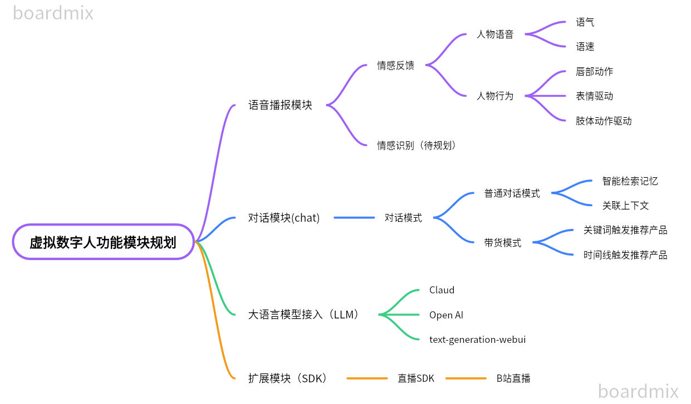

# SadTalker-Video-Lip-Sync


本项目基于SadTalkers、大语言模型（chat-gpt、claud等）实现数字人直播的功能, 数字人应用大模型对用户输入的prompt进行回答，在直播场景下，支持长短期记忆; 
大语言模型生成回答文本后，会利用tts转成音频文件，应用SadTalker进行唇形、表情合成，使合成的唇形更为流畅、真实以及自然，使数字人的形象更加逼真
目前因暂未支持接入大模型以及未使用GPU进行加速的原因，生成口播视频的速度较慢，因此目前只支持口播功能
后续会接入大语言模型，让数字人能够根据弹幕或者聊天prompt进行口播回答，使虚拟数字人入人类生活，作为恋爱导师，心理咨询师，解决人类的情感需求，打造爆款虚拟人主播

## 虚拟数字人功能模块规划



## 1.环境准备(Environment)
- python: 3.90.12
- node: 15.14.0

### 先决条件
- 安装conda，在Linux或WSL上，可以使用以下两个命令自动安装它（源代码）
  - 其他安装方式：[anaconda](https://anaconda.org.cn/anaconda/install/windows/)
```shell
- 初始化环境
```shell
conda create -n vw python=3.10.12
conda activate vw
conda install -c conda-forge nodejs=15.14.0
```
curl -sL "https://repo.anaconda.com/miniconda/Miniconda3-latest-Linux-x86_64.sh" > "Miniconda3.sh"
bash Miniconda3.sh

- 安装项目依赖

```python
pip install torch==1.12.1+cu113 torchvision==0.13.1+cu113 torchaudio==0.12.1 --extra-index-url https://download.pytorch.org/whl/cu113
conda install ffmpeg
pip install -r requirements.txt

#如需使用DAIN模型进行补帧需安装paddle
# CUDA 11.2
python -m pip install paddlepaddle-gpu==2.3.2.post112 \
-f https://www.paddlepaddle.org.cn/whl/linux/mkl/avx/stable.html
```

## 2.项目结构(Repository structure)

```
SadTalker-Video-Lip-Sync
├──checkpoints 预训练模型
|   ├──BFM_Fitting
|   ├──DAIN_weight
|   ├──hub
|   ├── ...
├──dian_output
|   ├── ...
├──examples 原始视频样例
|   ├── driven_audio
|   ├── driven_video
|   ├── first_frame_dir
├
├──results 生成结果存放目录
|   ├── ...
├──src 生成视频各个工具类
|   ├── ...
├──sync_show
├──third_part
|   ├── ...
├──chatbootapp 前端页面展示
├──mysite 基于django框架的服务器
├──inference.py
├──README.md
```

# Roadmap
- [ ] 基于SadTalker唇部表情的音画同步视频合成
- [x] 记忆模块优化
    - [x] 支持联想记忆
    - [x] 提高记忆检索的准确度
    - [x] 支持记忆遗忘机制，去除不重要的记忆，让AI更加专注
- [x] 情感涌现模块优化
    - [x] 支持模型肢体动作控制
    - [x] ~~支持人物的语气、语速控制~~
- [x] 语音模块
    - [x] 支持Edge（微软）、Bert-VITS2语音切换
- [x] 大语言模型接入
    - [x] 融合chatGPT

## 3.lip_sync 模型推理(Inference)

```python
python inference.py --driven_audio <audio.wav> \
                    --source_video <video.mp4> \
                    --enhancer <none,lip,face> \  #(默认lip)
                    --use_DAIN \ #(使用该功能会占用较大显存和消耗较多时间)
             		--time_step 0.5 #(插帧频率，默认0.5，即25fps—>50fps;0.25,即25fps—>100fps)
```


## 4.lip_syn 合成效果(Results)

```python
#合成效果展示在./sync_show目录下：
#original.mp4 原始视频
#sync_none.mp4 无任何增强的合成效果
#none_dain_50fps.mp4 只使用DAIN模型将25fps添帧到50fps
#lip_dain_50fps.mp4 对唇形区域进行增强使唇形更清晰+DAIN模型将25fps添帧到50fps
#face_dain_50fps.mp4 对全脸区域进行增强使唇形更清晰+DAIN模型将25fps添帧到50fps

#下面是不同方法的生成效果的视频
#our.mp4 本项目SadTalker-Video-Lip-Sync生成的视频
#sadtalker.mp4 sadtalker生成的full视频
#retalking.mp4 retalking生成的视频
#wav2lip.mp4 wav2lip生成的视频
```

https://user-images.githubusercontent.com/52994134/231769817-8196ef1b-c341-41fa-9b6b-63ad0daf14ce.mp4

视频拼接到一起导致帧数统一到25fps了，插帧效果看不出来区别，具体细节可以看./sync_show目录下的单个视频进行比较。

readme中展示视频做了resize，原始视频可以看./sync_show目录下不同类别合成的视频进行比较。

## 5.lip_sync 预训练模型（Pretrained model）

预训练的模型如下所示：

```
├──checkpoints
|   |──BFM_Fitting
|   |──DAIN_weight
|   |──hub
|   |──auido2exp_00300-model.pth
|   |──auido2pose_00140-model.pth
|   |──epoch_20.pth
|   |──facevid2vid_00189-model.pth.tar
|   |──GFPGANv1.3.pth
|   |──GPEN-BFR-512.pth
|   |──mapping_00109-model.pth.tar
|   |──ParseNet-latest.pth
|   |──RetinaFace-R50.pth
|   |──shape_predictor_68_face_landmarks.dat
|   |──wav2lip.pth
```


预训练的模型checkpoints下载路径:

百度网盘：https://pan.baidu.com/s/15-zjk64SGQnRT9qIduTe2A  提取码：klfv

谷歌网盘：https://drive.google.com/file/d/1lW4mf5YNtS4MAD7ZkAauDDWp2N3_Qzs7/view?usp=sharing

夸克网盘：https://pan.quark.cn/s/2a1042b1d046  提取码：zMBP

```python
#下载压缩包后解压到项目路径（谷歌网盘和夸克网盘下载的需要执行）
cd SadTalker-Video-Lip-Sync 
tar -zxvf checkpoints.tar.gz
```

## 后端工程 mysite
### 如何启动 mysite

- 进入 mysite 文件夹
```shell
cd mysite
```
- 安装 mysite 项目依赖
```shell
pip3 install -r requirements.txt
```
- 初始化项目数据库
```shell
python manage.py makemigrations 
```
```shell
python manage.py migrate 
```
- 启动domain-chatbot项目
```shell
python manage.py runserver
```
## 前端页面


###

### 如何启动 chatbootapp 前端页面
- 进入 chatbootapp 文件夹
```shell
cd chatbootapp
```
- 安装 chatbootapp 项目依赖
```shell
rm package-lock.json
npm install
```
- 启动 chatbootapp 项目
```shell
npm run dev
```
- Web访问路径
```shell
http://localhost:3000/
```

## 参考(Reference)

- SadTalker:https://github.com/Winfredy/SadTalker
- VideoReTalking：https://github.com/vinthony/video-retalking
- DAIN :https://arxiv.org/abs/1904.00830
- PaddleGAN:https://github.com/PaddlePaddle/PaddleGAN